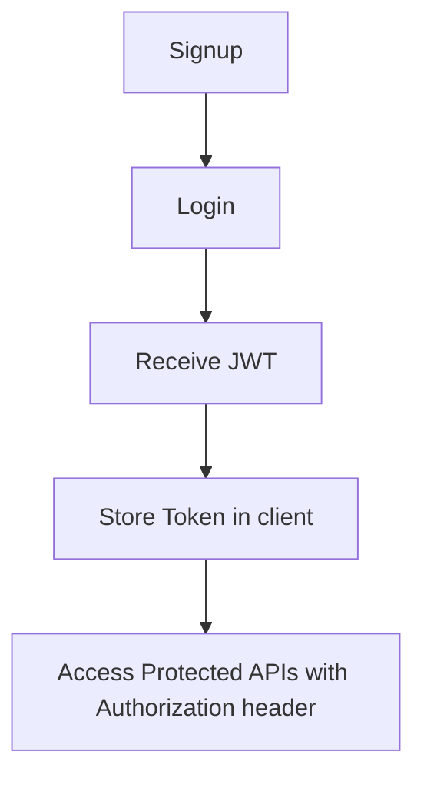

# API Documentation – StockFlow MVP

---
## 1. Project Overview
- **Project Name:** StockFlow MVP
- **Description:** A simple inventory and product management system with organizations, dashboards, and settings. Built with Express.js (backend) and a React/Vite frontend.
- **Tech Stack:** Node.js, Express, SQLite (better‑sqlite3), JWT, React, Vite.
- **Authentication Method:** JSON Web Token (JWT) passed in the `Authorization: Bearer <TOKEN>` header.
- **Base API URL:** `http://localhost:5000/api`
- **API Version:** v1 (all routes are prefixed with `/api`)

---
## 2. Project Features
- User registration and login with JWT authentication
- Organization creation and retrieval (one organization per user)
- CRUD operations for products (create, read, update, delete)
- Read‑only inventory view per organization
- Dashboard statistics (total products, inventory value, low‑stock count)
- Organization‑specific settings (low‑stock threshold, UI theme)
- Health‑check endpoint for service monitoring

---
## 3. Authentication
The API uses **JWT** for protecting most routes.

- After a successful **signup** (`POST /auth/signup`) or **login** (`POST /auth/login`) the server returns a token.
- Include the token in every protected request:
```http
Authorization: Bearer <JWT_TOKEN>
```
- The `protect` middleware verifies the token with `JWT_SECRET` and attaches the decoded user object to `req.user`.
- Endpoints that require authentication are marked **Yes** in the tables below.

---
## 4. API Endpoints
### 4.1 Authentication
| Method | Endpoint | Auth | Request Body | Query Params | Success Response | Status Codes |
|--------|----------|------|--------------|--------------|------------------|--------------|
| POST | `/auth/signup` | No | `{ "name":"John Doe", "email":"john@example.com", "password":"StrongPass123" }` | – | `{ "success": true, "message": "User registered successfully", "data": { "user": { "id": 1, "name": "John Doe", "email": "john@example.com" }, "token": "<jwt>" }` | 201, 400 |
| POST | `/auth/login` | No | `{ "email":"john@example.com", "password":"StrongPass123" }` | – | `{ "success": true, "message": "User logged in successfully", "data": { "user": { "id": 1, "name": "John Doe", "email": "john@example.com" }, "token": "<jwt>" }` | 200, 400, 401 |
| GET | `/auth/me` | Yes | – | – | `{ "success": true, "data": { "user": { "id": 1, "name": "John Doe", "email": "john@example.com", "organization_id": 2 } }` | 200, 401 |

### 4.2 Health Check
| Method | Endpoint | Auth | Request Body | Query Params | Success Response | Status Codes |
|--------|----------|------|--------------|--------------|------------------|--------------|
| GET | `/health` | No | – | – | `{ "status": "ok", "timestamp": "2026-07-06T04:57:38.000Z", "uptime": 1234.56 }` | 200 |

### 4.3 Organization
| Method | Endpoint | Auth | Request Body | Query Params | Success Response | Status Codes |
|--------|----------|------|--------------|--------------|------------------|--------------|
| POST | `/organizations` | Yes | `{ "name":"Acme Corp" }` | – | `{ "success": true, "data": { "id": 1, "name": "Acme Corp", "ownerId": 42 } }` | 201, 400, 401 |
| GET | `/organizations/me` | Yes | – | – | `{ "success": true, "data": { "id": 1, "name": "Acme Corp", "ownerId": 42 } }` | 200, 401, 404 |

### 4.4 Products
| Method | Endpoint | Auth | Request Body | Query Params | Success Response | Status Codes |
|--------|----------|------|--------------|--------------|------------------|--------------|
| GET | `/products` | Yes | – | – | `{ "success": true, "data": [ { "id": 1, "name": "Laptop", "sku": "LAP001", "price": 999.99, "cost_price": 800, "quantity_on_hand": 10, "description": "High‑end laptop", "low_stock_threshold": 5 } ] }` | 200, 401 |
| POST | `/products` | Yes | ```json
{ "name":"Laptop", "sku":"LAP001", "price":999.99, "cost_price":800, "quantity_on_hand":10, "description":"High‑end laptop", "low_stock_threshold":5 }
``` | – | `{ "success": true, "data": { "id": 2, "name": "Laptop", "sku": "LAP001", "price": 999.99, "cost_price": 800, "quantity_on_hand": 10, "description": "High‑end laptop", "low_stock_threshold": 5 } }` | 201, 400, 401 |
| GET | `/products/:id` | Yes | – | – | `{ "success": true, "data": { "id": 2, "name": "Laptop", "sku": "LAP001", "price": 999.99, "cost_price": 800, "quantity_on_hand": 10, "description": "High‑end laptop", "low_stock_threshold": 5 } }` | 200, 401, 404 |
| PUT | `/products/:id` | Yes | Same shape as POST (partial fields allowed) | – | `{ "success": true, "data": { "id": 2, "name": "Laptop Pro", "sku": "LAP001", "price": 1099.99, "cost_price": 850, "quantity_on_hand": 8, "description": "Updated model", "low_stock_threshold": 5 } }` | 200, 400, 401, 404 |
| DELETE | `/products/:id` | Yes | – | – | `{ "success": true, "message": "Product deleted successfully" }` | 200, 401, 404 |

### 4.5 Inventory (read‑only)
| Method | Endpoint | Auth | Request Body | Query Params | Success Response | Status Codes |
|--------|----------|------|--------------|--------------|------------------|--------------|
| GET | `/inventory` | Yes | – | – | `{ "success": true, "data": [ { "id": 1, "type": "addition", "productId": 2, "quantity": 5, "date": "2026-07-06" } ] }` | 200, 401 |
| GET | `/inventory/:id` | Yes | – | – | `{ "success": true, "data": { "id": 1, "type": "addition", "productId": 2, "quantity": 5, "date": "2026-07-06" } }` | 200, 401, 404 |

### 4.6 Dashboard
| Method | Endpoint | Auth | Request Body | Query Params | Success Response | Status Codes |
|--------|----------|------|--------------|--------------|------------------|--------------|
| GET | `/dashboard/stats` | Yes | – | – | `{ "success": true, "data": { "totalProducts": 12, "totalInventoryValue": 54321, "lowStockCount": 3 } }` | 200, 401, 403 |

### 4.7 Settings
| Method | Endpoint | Auth | Request Body | Query Params | Success Response | Status Codes |
|--------|----------|------|--------------|--------------|------------------|--------------|
| GET | `/settings` | Yes | – | – | `{ "success": true, "data": { "defaultLowStockThreshold": 5, "theme": "light" } }` | 200, 401 |
| PUT | `/settings` | Yes | `{ "defaultLowStockThreshold":10, "theme":"dark" }` | – | `{ "success": true, "data": { "defaultLowStockThreshold":10, "theme":"dark" } }` | 200, 400, 401 |

---
## 5. Request Examples
```json
// Signup
{
  "name": "John Doe",
  "email": "john@example.com",
  "password": "StrongPass123"
}

// Login
{
  "email": "john@example.com",
  "password": "StrongPass123"
}

// Create Organization
{
  "name": "Acme Corp"
}

// Create Product
{
  "name": "Laptop",
  "sku": "LAP001",
  "price": 999.99,
  "cost_price": 800,
  "quantity_on_hand": 10,
  "description": "High‑end laptop",
  "low_stock_threshold": 5
}

// Update Settings
{
  "defaultLowStockThreshold": 10,
  "theme": "dark"
}
```

---
## 6. Response Examples
```json
// Successful signup (201)
{
  "success": true,
  "message": "User registered successfully",
  "data": {
    "user": { "id": 1, "name": "John Doe", "email": "john@example.com" },
    "token": "<jwt>"
  }
}

// Successful product list (200)
{
  "success": true,
  "data": [
    {
      "id": 1,
      "name": "Laptop",
      "sku": "LAP001",
      "price": 999.99,
      "cost_price": 800,
      "quantity_on_hand": 10,
      "description": "High‑end laptop",
      "low_stock_threshold": 5
    }
  ]
}

// Error response (400 Bad Request)
{
  "success": false,
  "message": "Product name is required"
}
```

---
## 7. Error Responses
| Code | Meaning | Example JSON |
|------|---------|--------------|
| 400 | Bad Request – validation or malformed payload | `{ "success": false, "message": "Price must be a valid number" }` |
| 401 | Unauthorized – missing or invalid JWT | `{ "success": false, "message": "Invalid token" }` |
| 403 | Forbidden – user lacks required organization | `{ "success": false, "message": "User does not belong to an organization" }` |
| 404 | Not Found – resource does not exist | `{ "success": false, "message": "Product not found" }` |
| 500 | Internal Server Error | `{ "success": false, "message": "Something went wrong" }` |

---
## 8. Authentication Flow


---
## 9. Database Models (summary)
- **User**: `id`, `name`, `email`, `passwordHash`, `organization_id`
- **Organization**: `id`, `name`, `owner_id`
- **Product**: `id`, `name`, `sku`, `price`, `cost_price`, `quantity_on_hand`, `description`, `low_stock_threshold`, `organization_id`
- **Settings**: `organization_id`, `defaultLowStockThreshold`, `theme`
- **InventoryTransaction**: `id`, `type` (addition/removal), `productId`, `quantity`, `date`, `organization_id`

---
## 10. Environment Variables
| Variable | Description |
|----------|-------------|
| `PORT` | Port on which the Express server listens (default 5000) |
| `NODE_ENV` | `development` or `production` |
| `JWT_SECRET` | Secret key used to sign JWTs |
| `JWT_EXPIRES_IN` | Token expiry (e.g., `7d`) |
| `DATABASE_PATH` | Path to SQLite DB (default `./data/stockflow.db`) |

---
## 11. Running Locally
```bash
# Clone the repository
git clone https://github.com/devadiravindranath/stockflow.git
cd stockflow

# Backend setup
cd backend
npm install
npm run dev   # starts src/server.js with nodemon (listens on http://localhost:5000)

# Frontend setup
cd ../frontend
npm install
npm run dev   # Vite dev server (http://localhost:5173)
```

---
## 12. API Testing
- Use **Postman** or **Thunder Client**.
- For protected routes, add header:
```
Authorization: Bearer <JWT_TOKEN>
```
- Verify status codes and response bodies match the tables above.

---
## 13. Deployment
- **Frontend URL:** `https://stockflow-frontend-8hmk.onrender.com/`
- **Backend API URL:** `https://stockflow-backend-uur8.onrender.com/api`
- **GitHub Repository:** `https://github.com/devadiravindranath/stockflow.git`
- **GitHub Repository:** `https://github.com/devadiravindranath/stockflow.git`

---

